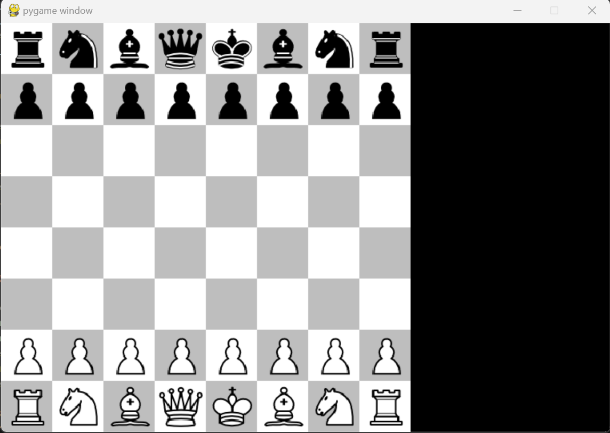

### Chess implementation using AI

This is a chess implementation in pygame based on the playlist of Eddie Sharick <a href="https://www.youtube.com/watch?v=EnYui0e73Rs&list=PLBwF487qi8MGU81nDGaeNE1EnNEPYWKY_&ab_channel=EddieSharick"> here </a>

